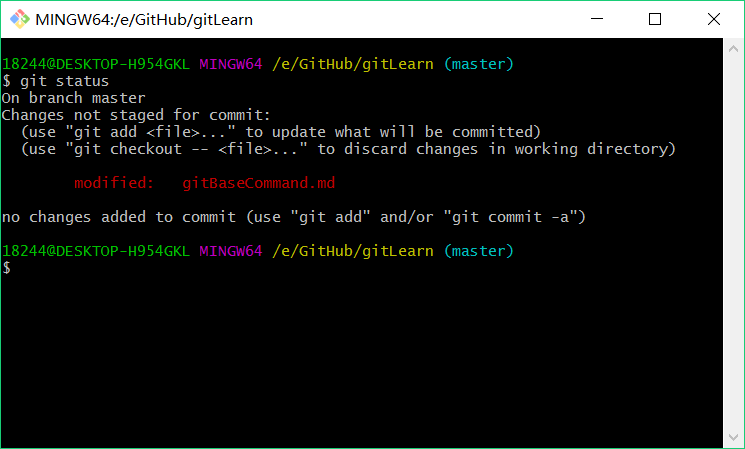
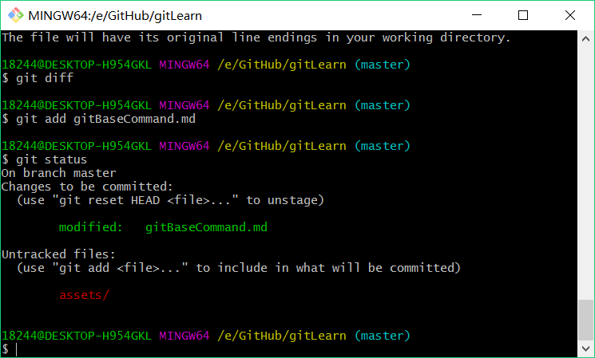
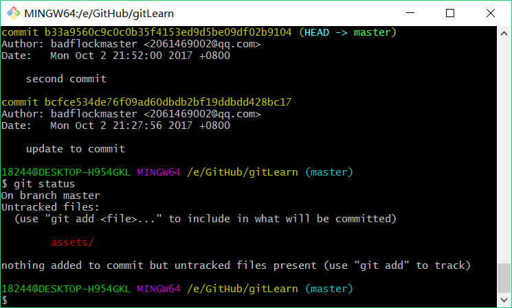
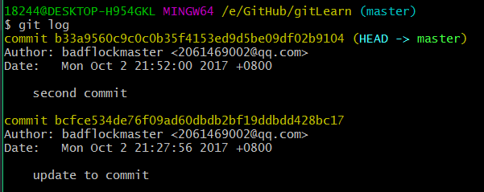
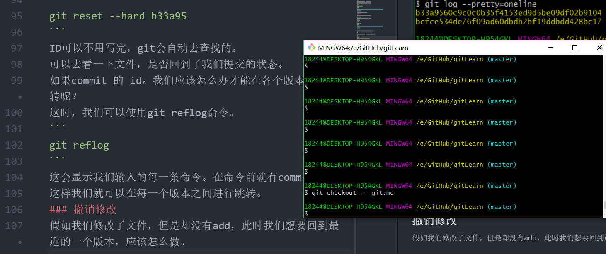
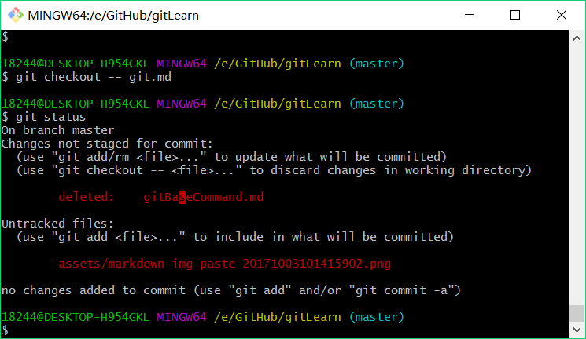
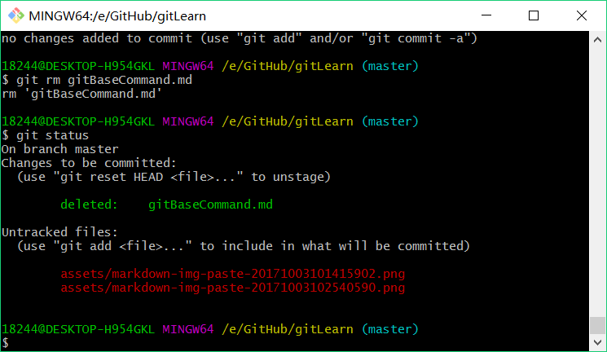
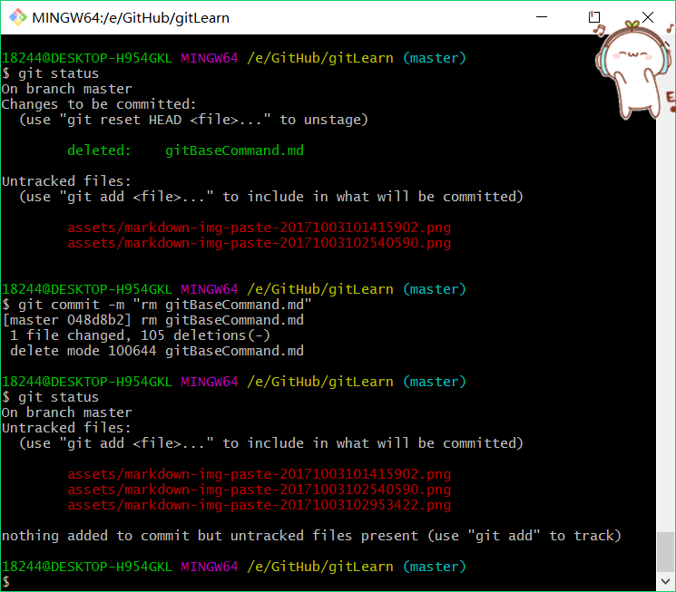

# git 命令学习笔记
## git 初始化配置
1. git config --global user.name "在这里输入username"
2. git config --global user.mail "在这里输入usermail"

ps: 注意命令中的空格，输入之后， enter键执行

## 创建本地版本库
1. 首先需要创建一个文件夹（例如我想在d:/github/GitLearn中创建一个版本库）
2. cd d:/github/gitLearn
3. pwd
4. 执行上述命令创建相应的文件夹
5. 其中的cd 用于创建一个文件夹
6. 而pwd 用于显/示当前路径
7. 正确执行gitBash 应该显示 /e/github/gitLearn
8. 此时表示git正确执行了我们的命令，创建了相应的文件夹

### 本地版本库的创建
```git
$ git init
Initialized empty Git repository in D:/github/gitLearn/.git/
```
运行git init 命令

正确运行后，显示上述结果

PS：此时我们查看我们创建的文件夹，会发现在我们创建的文件中多了一个.git 文件夹。如果没有发现，那么这个文件可能被隐藏。
```
ls -ah
```
运行这一条命令即可显示隐藏的.git文件夹
此时本地版本库已经创建完成。

## 使用git
### 创建一个文本文件，在这里我创建一个GitBaseCommand.md，用来记录git的学习笔记
PS：一定要放在GitLearn目录下，可以放在子目录下。
git add 用于将文件添加git中去。
```
git add gitBaseCommand.md
```
当然，此时不会显示任何东西。
接着输入git commit。告诉git，把文件提交到仓库。
```
git commit -m "message"
```
必须要在commit命令后面增加一个参数，并且输入提示消息。
以避免出现不必要的麻烦。
### 查看status
现在我们已将gitBaseCommand.md 文件添加并且提交到git中去了。可以，开始继续工作，修改文件了。

现在修改文件。修改完成后，输入git status
```
git status
```
git status命令，可以查看当前git的状态。

显示，在master分支上，文件被修改，但是却没有add和commit。
```
git add gitBaseCommand.md
```
等一下才commit文件
现在我们先查看一下文件状态
```
git status
```


显示信息提示我们。文件已经被添加到git。可以commit。
```
git commit -m "meassage"
```
提交完成。既然我们学习了git  status命令。
那么我们来查看一下commit后的git status
```
git status
```

信息显示，现在没有文件要commit。
### 版本倒退
我们现在已经提交过两次了。如果我们想回到上一次提交的时候应该怎么做呢？
或许我们应该查看一下，之前我们提交的信息。 以免回到错误的版本。
```
git log
```


git log命令可以查看最近到最远的log。即我们提交的日志。
如果觉得显示的信息太复杂，添加 --pretty=oneline 参数。
```
git log --pretty=oneline
```

从显示的信息可以，看出，我们一共提交了两次。那些数字，是commit的id。用这个id我们可以回到我们想要去的版本。
```
git reset --hard b33a95
```
ID可以不用写完，git会自动去查找的。
可以去看一下文件，是否回到了我们提交的状态。
如果commit 的 id。我们应该怎么办才能在各个版本之剪跳转呢？
这时，我们可以使用git reflog命令。
```
git reflog
```
这会显示我们输入的每一条命令。在命令前就有commit的id。
这样我们就可以在每一个版本之间进行跳转。
### 撤销修改
假如我们修改了文件，但是却没有add，此时我们想要回到最近的一个版本，应该怎么做。

```
git checkout -- git.md
```
ps：注意在checkout和文件名中间的 -- ，要与两边都有空格。
****
假如我们修改了文件，并且已经add。但是现在我们想要取消add操作。
```
git reset HEAD git.md
```
这样便取消了之前的add操作。但是文件的修改还在。相对于回到了第一种情况。
****


### 删除文件
如果我们删除了一个文件，此时我们运行git status命令查看，git的状态。
```
git status
```

如果是误删的文件，我们也可以选择回到删除之前最新的一个版本。
```
git checkout -- gitBaseCommand.md
```
git checkout 不仅可以回到修改之前的版本，也可以恢复误删的文件。
如果想要完全删除此文件，就要把git中的文件也要删除。
```
git rm gitBaseCommand.md
git status
```

现在文件已经删除了，显示文字已经变成了绿色。
但是现在还没有commit。
```
git commit -m "rm gitBaseCommand.md"
git status
```


现在便完成了删除操作。

## 远程版本库（remote）

```
git remote add origin https://github.com/badflockmaster/gitLearn.git
```
这样便将本地的git与远程的github练习起来。
我们现在是现在本地创建的git，所以现在我们需要将本地的git推送到github上去。
```
git push -u origin master
```
现在再去看一下github上的repository，发现已经更新到和本地的git一样。
PS：第一次push 需要增加一个-u 的参数，但是这样以后的push，就可以不需要这个参数了。
```
git push origin master
```
现在，便完成了push操作。
***
如果是先创建了远程git，而且已经有内容在github中了。现在需要在本地建立起联系。并且将内容clone到本地。
```
git clone https://github.com/badflockmaster/gitLearn.git
```
现在，git学习告一段落。
